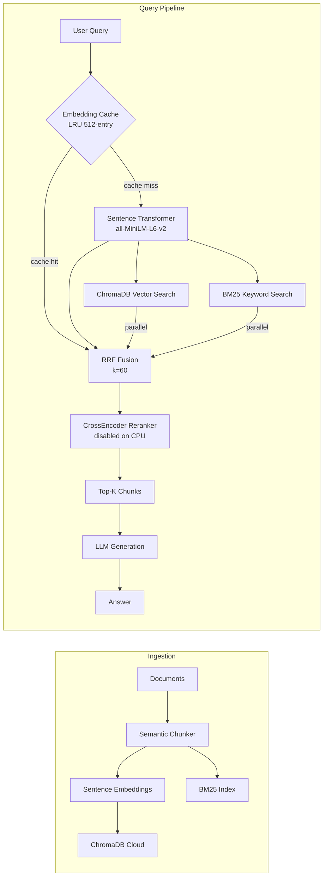

# RAG Pipeline — Semantic Chunking · Hybrid Retrieval · RRF Fusion


A configurable, production-aware RAG pipeline built from scratch for document QA, backed by ChromaDB Cloud for managed vector storage. Groq and Gemini APIs are required (see `.env.example`). The core technical contribution is a systematic ablation study across four pipeline configurations, demonstrating that semantic chunking combined with hybrid BM25+ChromaDB retrieval and RRF fusion achieves **+44% relative Recall@5** over a naive baseline at under 2.5 seconds P95 latency. What makes it engineering-grade is a config-driven pipeline, parallel retrieval, LRU embedding cache, and a formal evaluation harness with P50/P95/P99 latency reporting.

---

## Architecture



---

## Performance — Ablation Study

Each configuration was evaluated on the same held-out question set. Latency is P50 at query time on CPU (no GPU).

| Config | Chunking | Retrieval | Fusion | Reranker | Recall@5 | MRR | P50 Latency | vs Baseline |
|--------|----------|-----------|--------|----------|----------|-----|-------------|-------------|
| A — Baseline | Recursive | Vector only | — | ✗ | 0.188 | 0.140 | 2.1s | — |
| B | Semantic | Vector only | — | ✗ | 0.210 | 0.157 | 3.6s | +11.7% R@5 |
| C — **Recommended** | Semantic | Hybrid (BM25+ChromaDB) | RRF | ✗ | 0.270 | 0.175 | 1.7s | +43.6% R@5 |
| D | Semantic | Hybrid (BM25+ChromaDB) | RRF | ✓ | 0.280 | 0.170 | 14.3s | +48.9% R@5 |

> **Engineering decision:** Config D adds +1pp Recall@5 over C but costs +12.6s of CPU reranker latency. Config C is the production-recommended configuration. On a GPU (T4+), the reranker runs in ~0.1s and Config D becomes the better choice.

---

## Quick Start

```bash
git clone <your-repo-url> && cd <repo-name>
cp .env.example .env  # fill in your API keys
pip install -e .
streamlit run streamlit_app.py
```

Ingest QASPER documents into ChromaDB Cloud:

```bash
python scripts/ingest_qasper.py
```

Run the full ablation study (all 4 configs, comparison table printed at the end):

```bash
python eval/run_ablation.py
# Add --max-questions 20 for a quick smoke test
```

---

## Project Structure

```
├── config.yaml           # Pipeline configuration (chunking, retrieval, fusion flags)
├── pyproject.toml        # Project metadata and dependencies
├── streamlit_app.py      # Interactive Streamlit UI
├── Makefile              # Convenience targets (lint, test, run)
├── rag/
│   ├── retrieval.py      # Query pipeline: retrieve → fuse → generate
│   ├── pipeline.py       # RAGPipeline orchestration class
│   ├── chunkers.py       # Semantic and recursive chunking strategies
│   ├── embeddings.py     # Sentence-transformer embeddings with LRU cache
│   ├── ingest.py         # Document ingestion: chunk → embed → push
│   ├── loaders.py        # Document loaders
│   └── context_builder.py# Deduplication, token budget enforcement
├── db/
│   └── vectordb.py       # ChromaDB Cloud client and collection helpers
├── cache/
│   └── cache.py          # Redis-backed query response cache
├── app/
│   └── main.py           # FastAPI streaming endpoint
├── observability/
│   ├── logger_config.py  # Structured logging
│   └── metrics.py        # Prometheus metrics
├── eval/
│   ├── run_eval.py       # Single-config evaluation with P50/P95/P99 latency
│   └── run_ablation.py   # Runs all 4 configs, prints comparison table
├── tests/
│   └── unit/             # Unit tests (fusion, chunkers, retrieval)
├── scripts/
│   └── ingest_qasper.py  # QASPER dataset ingestion script
└── docs/
    ├── TECHNICAL_DEEP_DIVE.md
    ├── EVALUATION_REPORT.md
    └── INTERVIEW_PREP.md
```

---

## Tech Stack

| Component | Technology | Why this choice |
|-----------|------------|-----------------|
| Embeddings | sentence-transformers (`all-MiniLM-L6-v2`) | Fast, high-quality, runs entirely on CPU |
| Vector store | ChromaDB Cloud | Managed, serverless, no infra to maintain |
| Keyword search | rank_bm25 | Pure Python BM25, no external server needed |
| Fusion | Custom RRF (k=60) | Proven formula from Cormack et al. (2009), zero latency cost |
| Reranker | `cross-encoder/ms-marco-MiniLM-L-6-v2` | State-of-the-art passage reranking; GPU-gated |
| Chunking | Semantic similarity (sentence-transformers) | Semantic boundary detection vs. naive character splits |
| LLM | Groq `llama-3.1-8b-instant` / Gemini fallback | Fast inference via Groq API |
| Config | PyYAML | Human-readable pipeline configuration |
| Eval | Custom harness (numpy, json) | Full control over metrics; no eval vendor lock-in |

---

## Documentation

See [Technical Deep Dive](docs/TECHNICAL_DEEP_DIVE.md) for architecture decisions and [Evaluation Report](docs/EVALUATION_REPORT.md) for the full methodology and results.

---

## License

MIT
